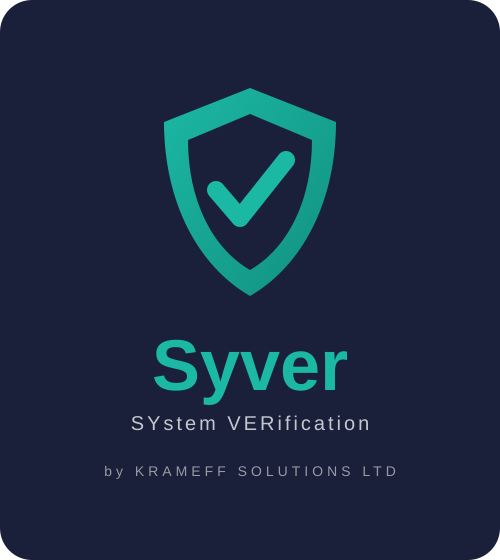

# Syver - Quick and Easy server validation

<!-- markdownlint-disable no-inline-html -->

  

<!-- markdownlint-enable no-inline-html -->

--8<-- "README.md:intro"
--8<-- "README.md:about"

## Documentation

* [goss vs Syver](goss-vs-syver.md) — what this project is, and exactly how it
  differs from the upstream it continues
* [Installation](installation.md) — install syver, dgoss, and the other wrappers
* [Quickstart](quickstart.md) — write and run your first gossfile
* [Container image](container_image.md) — run syver from the published container image
* [Command reference](cli.md) — CLI flags for `validate`, `serve`, `add`, and friends
* [The gossfile](gossfile.md) — full resource and matcher reference, including
  [discovery](gossfile.md#discovery) and
  [test dependencies (`depends-on`)](gossfile.md#test-dependencies)
* [Migration guide](migrations.md) — breaking changes between versions
* [Platforms](platforms.md) — per-platform support notes and caveats
* [Windows](windows.md) — opt-in alpha support: what works, what does not, and
  what reports honestly rather than guessing
* Containers — [Docker](containers/docker.md), [Docker Compose](containers/docker-compose.md), [Kubernetes](containers/kubernetes.md)
* [Contributing](contributing.md) — development setup and contribution guidelines
* [Testing](testing.md) — running the test suite locally, and how those checks
  map to CI
* [Changelog](changelog.md) — release history
* [License](license.md)
